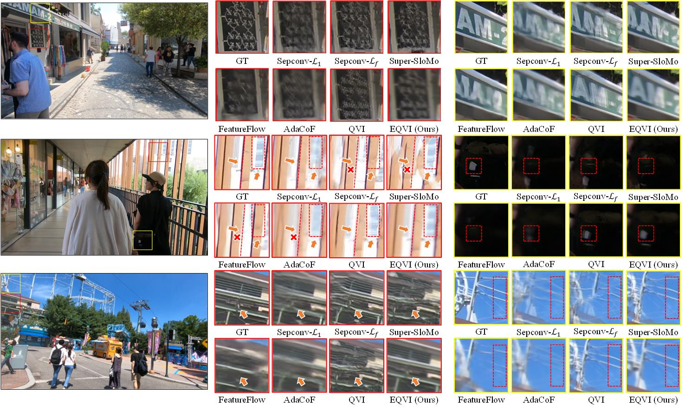

# EQVI-Enhanced Quadratic Video Interpolation
## winning solution of AIM2020 VTSR Challenge
Authors: Yihao Liu, Liangbin Xie, Li Siyao, Wenxiu Sun, Yu Qiao, Chao Dong
[paper]

If you find our work is useful, please kindly cite it.
```
@InProceedings{liu2020enhanced,  
author = {Yihao Liu and Liangbin Xie and Li Siyao and Wenxiu Sun and Yu Qiao and Chao Dong},  
title = {Enhanced quadratic video interpolation},  
booktitle = {European Conference on Computer Vision Workshops},  
year = {2020},  
}
```



## Preparation
### Dependencies
- Python >= 3.6
- Tested on PyTorch==1.2.0 (may work for other versions)
- Tested on Ubuntu 18.04.1 LTS
- NVIDIA GPU + [CUDA](https://developer.nvidia.com/cuda-downloads)

### Install correlation package
In our implementation, we use [ScopeFlow](https://github.com/avirambh/ScopeFlow) as a pretrained flow estimation module.  
Please follow the instructions to install the required correlation package:
```
cd models/scopeflow_models/correlation_package
python setup.py install
```
Note:  
if you use CUDA>=9.0, just execute the above commands straightforward;  
if you use CUDA==8.0, you need to change the folder name `correlation_package_init` into `correlation_package`, and then execute the above commands.

Please refer to [ScopeFlow](https://github.com/avirambh/ScopeFlow) and [irr](https://github.com/visinf/irr) for more information.

### Download pretrained models
- :zap: Currently we only provide EQVI models trained on REDS_VTSR dataset.
- :zap: We empirically find that the training datasets have significant influence on the performance. That is to say, there exists a large dataset bias. When
the distribution of training and testing data mismatch, the model performance could dramatically drop. Thus, the generalizability of video interpolation methods is worth investigating.

- The pretrained models can be downloaded at [Google Drive](https://drive.google.com/file/d/1n1N8Sc2HK5Wy0JHX5FXviO1aV73cWXOD/view?usp=sharing).  
[Baidu Drive] will be ready soon.
- Unzip the downloaded zip file in the project root dir.
```
unzip checkpoints.zip
```
There should be four models in the `checkpoints` folder:
- `checkpoints/scopeflow/Sintel_ft/checkpoint_best.ckpt`   
\# pretrained ScopeFlow model with Sintel finetuning (you can explore other released models of [ScopeFlow](https://github.com/avirambh/ScopeFlow))
- `checkpoints/Stage3_RCSN_RQFP/Stage3_checkpoint.ckpt`    
\# pretrained Stage3 EQVI model (RCSN + RQFP)
- `checkpoints/Stage4_MSFuion/Stage4_checkpoint.ckpt`      
\# pretrained Stage4 EQVI model (RCSN + RQFP + MS-Fusion)
- `checkpoints/Stage123_scratch/Stage123_scratch_checkpoint.ckpt`  
\# pretrained Stage123 EQVI model from scratch

### Data preparation
The REDS_VTSR train and validation dataset can be found [here](https://competitions.codalab.org/competitions/24584#participate-get-data).  
More datasets and models will be included soon.

## Quik Testing
1. Specify the inference settings  
modify `configs/config_xxx.py`, including:  
  - `testset_root` 
  - `test_size`
  - `test_crop_size`
  - `inter_frames`
  - `store_path`  
etc.

2. Execute the following command to start inference:
```
CUDA_VISIBLE_DEVICES=0 python interpolate_REDS_VTSR.py configs/config_xxx.py
```
The output results will be stored in the specified `$store_path$`.  
Note: `interpolate_REDS_VTSR.py` is specially coded with REDS_VTSR dataset. For other testing datasets, you may need to modify this file. We will consider providing a generic inference script for other datasets.

